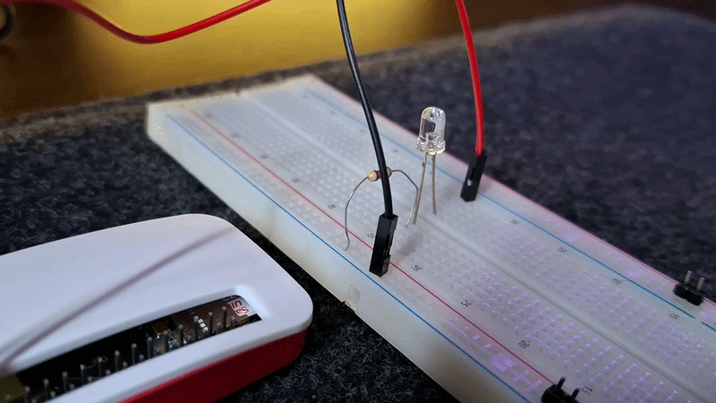
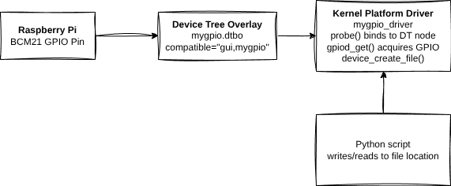

# Kernel module to control a GPIO pin

### Inspiration

The code here was inspired by the series of videos by the chanel "Low Level" in which he demonstrates a simple kernel module to control gpios on a raspberry pi, for more details refer to the original video:
https://www.youtube.com/watch?v=lWzFFusYg6g&list=PLc7W4b0WHTAX4F1Byvs4Bp7c8yCDSiKa9&index=1

This little project was done just for studying purposes, and by no means this is a "super hyper professional" way of coding a kernel module. ;)

### procfs file system

procfs is a process file system generated dynamically by the kernel that gives access to kernel parameters, process and hardware information, system memory, CPU stats, etc.

Some tools that use procfs are: __ps__, __top__, __htop__, __free__, __uptime__, __lscpu__.

### Some details

When executed on rasp zero 2W, the command:
`cat /proc/iomem | grep gpio`

will give the output:
`00000000-00000000 : 3f200000.gpio gpio@7e200000`

This gives us the physical address to the gpio peripheral, but we don't want use this hardcoded address...instead we should use the:
<pre>gpiod_get()</pre> 
Which is part of the Linux GPIO descriptor API. By using this function we can guarantee portability between rasp models and future proof as well (in case the address changes in the future), by using the:
<pre>ioremap(0x3f20000, size);</pre>
we are ignoring concurrency and power management which can cause conflicts with other drivers and GPIO users.

The first commits in this repo were using the hardcoded address and _ioremap_ just like the video by "Low Level".

# New "Modern" Version

The last version uses a more modern approach with gpiod_get() and thus a .dts overlay is required which will describe the gpio pin. Also now sysfs is being used instead of procfs which is a modern strucuture interface for devices.

## Sysfs

Exposes the kernel device model and hardware information, it is a strict and structured interface.

- /sys/devices/ → Physical devices
- /sys/class/ → Device classes (network, block, etc.)
- /sys/bus/ → Bus types (PCI, USB, etc.)
- /sys/module/ → Loaded kernel modules

## Code details

### Memory Management APIs
This comes from the header `<linux/device.h>`

<pre>data = devm_kzalloc(&pdev->dev, sizeof(*data), GFP_KERNEL);</pre>

This function allocates a zero-initialized memory for the struct, this memory is managed by the device resource system.
- &pdev->dev → device that owns this memory
- size → number of bytes
- GFP_KERNEL → normal kernel allocation flag (can sleep)

### GPIO Descriptor Consumer API
These functions come from the header: `<linux/gpio/consumer.h>.`

<pre>data->led = devm_gpiod_get(&pdev->dev, "led", GPIOD_OUT_LOW);</pre>

This function obtains the GPIO descriptor from the Device Tree. This is the modern descriptor-based way from the GPIO API.
- &pdev->dev → device requesting GPIO
- "led" → GPIO name (matches led-gpios in DT)
- GPIOD_OUT_LOW → configure as output, initial value LOW

When this function is called, kernel will look for something like `led-gpios = <...>;` matching the content on the .dts overlay file.

It should return the `struct gpio_desc *` on success or `ERR_PTR()` on failure.

<pre>gpiod_set_value(data->led, 1);</pre>

This is used to set the GPIO output value.
- 0 → low
- 1 → high

<pre>gpiod_get_value(data->led)</pre>

As the name implies, this funcion reads the GPIO value.

### Driver Data Helpers

<pre>platform_set_drvdata(pdev, data)</pre>
<pre>dev_get_drvdata(dev)</pre>
Associates private driver data with platform device, later to be retrieved.

### Sysfs Attribute APIs

<pre>static DEVICE_ATTR(led, 0664, led_show, led_store);</pre>

Create device attribute with permissions

<pre>device_create_file(dev, &dev_attr_led)</pre>
<pre>device_remove_file(dev, &dev_attr_led)</pre>

Create and remove the sysfs file.

### Platform Driver Framework

<pre>static struct platform_driver my_gpio_driver</pre>

This struct is used to register the driver for the device, some important fields are:
<pre>
.probe	                Called when device matches
.remove	                Called on removal
.driver.name	        Driver name
.driver.of_match_table	Device Tree match table
</pre>

<pre>module_platform_driver(my_gpio_driver)</pre>

Automatically registers/unregisters the driver. This macro expands to:
<pre>
module_init(...)
module_exit(...)
</pre>

### Device tree matching
From the header: `<linux/of.h>`

By the snippet on the code:

<pre>
static const struct of_device_id my_gpio_of_match[] = {
    { .compatible = "gui,mygpio" },
    { }
};
</pre>

Kernel will look for something like this:
<pre>compatible = "gui,mygpio";</pre>

<pre>MODULE_DEVICE_TABLE(of, my_gpio_of_match)</pre>
This exports the match table so it can be loaded.

### LED blinker python script

This is just a simple script that access the sysfs file from user space and makes the LED blink.

# General Flow

This drawing ius just a general idea of how things flow.

